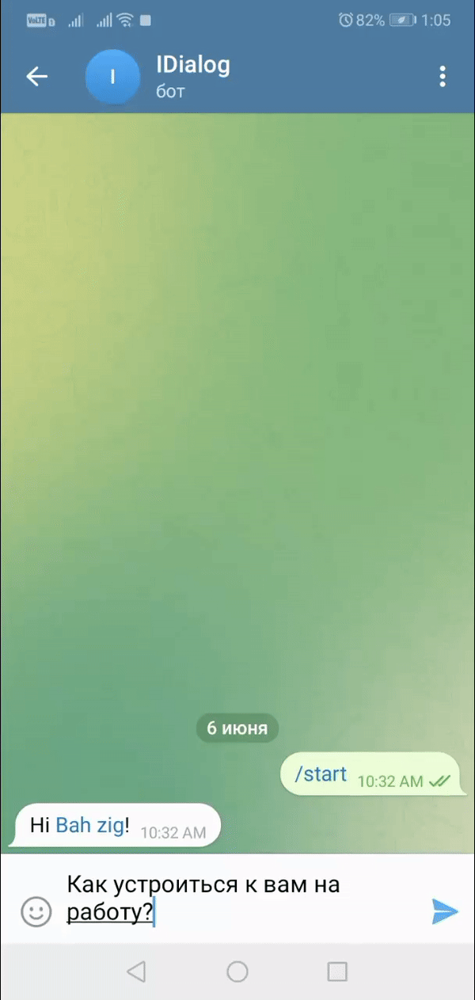
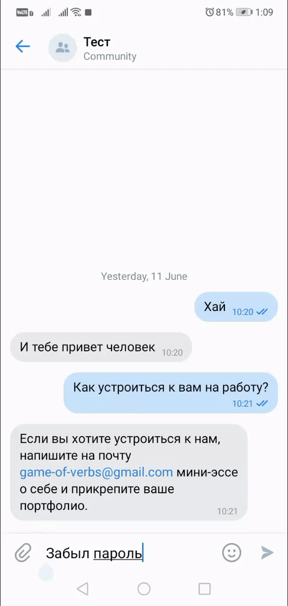

# Бот для общение 
Бот который может понимать речь и отвечать на вопросы


## Задачи, которые выполняет
* Общение в телеграм 
* Интеграция с Google DialogFlow
## Требования 
* рекомендуется Python 3.9(можно З.7, 3.8, 3.10) 
* требуется создать приложение [dialog flow в google cloud](https://cloud.google.com/dialogflow/es/docs/quick/setup)
## Запуск проекта
### 1. Загрузка на локальное устройство 
```shell
git clone https://github.com/ZiganshinIB/idialog_bot
cd idialog_bot
```
### 2. Создание витруального окружение
```shell
python -m venv .venv
```
#### 2.1 Активация витруального окружение
```shell
source .venv/bin/activate
```
### 3. Установка зависимостей
```shell
pip install -r requirements.txt
```
### 4. Создание переменых сред
В проекте используются токены (ключи и пароли), которые не должны хранится в открытом доступе. По этому такие данные храним в системной переменных среде, следующим образом:
В директории с проектом создается файл `.env`
```shell
nano .env
```
Заполняется следующим способом
```text
TELEGRAM_BOT_TOKEN='Токен_для_телеграм_бота'
TELEGRAM_BOT_LOGS_CHAT_ID=1
DIALOG_FLOW_PROJECT_ID='название вашего проекта'
GOOGLE_API_KEY='Google api ключ'
GOOGLE_APPLICATION_CREDENTIALS=''
DIALOGFLOW_SESSION_ID='me'
VK_API_TOKEN=''
```
* Как получить токен для телеграм бота описана [тут](https://core.telegram.org/bots#how-do-i-create-a-bot)
* TELEGRAM_BOT_LOGS_CHAT_ID - идентификатор чата куда будуть логи работы программы. [Узнать чат id](https://docs.leadconverter.su/faq/populyarnye-voprosy/telegram/kak-uznat-id-telegram-gruppy-chata)
* DIALOG_FLOW_PROJECT_ID - название проекта
* GOOGLE_API_KEY - личный ключ. [Инструкция](https://cloud.google.com/docs/authentication/api-keys)
* VK_API_TOKEN инструкция по получению токена [тут](https://vk.com/@vksoftred-kak-poluchit-token-soobschestva-vkontakte)


### 5. Запуск проектов
```shell
python tg_message_bot.py
python vk_message_bot.py
```

## Дополнительные фичи
### Обучение новым словам 
В модули ```dialog_flow_worker``` содержит метод create_intent, который принимает на вход следующие значении
project_id: ID проекта в Google Cloud
display_name: Тема интента
training_phrases_parts: Список набора фраз, предложении и сообщений.
message_texts: Список ответов на training_phrases_parts.
Пример работы:
```python
from dialog_flow_worker import create_intent
import os

project_id = os.getenv('DIALOG_FLOW_PROJECT_ID')
display_name = "Устройство на работу"
training_phrases_parts = [
    "Как устроиться к вам на работу?",
    "Как устроиться к вам?",
    "Как работать у вас?",
    "Хочу работать у вас",
    "Возможно-ли устроиться к вам?",
    "Можно-ли мне поработать у вас?",
    "Хочу работать редактором у вас"
]
message_texts = [
    "Если вы хотите устроиться к нам, напишите на почту game-of-verbs@gmail.com мини-эссе о себе и прикрепите ваше портфолио.",
]
create_intent(
    project_id=project_id,
    display_name=display_name,
    training_phrases_parts=training_phrases_parts,
    message_texts=message_texts
)
```
